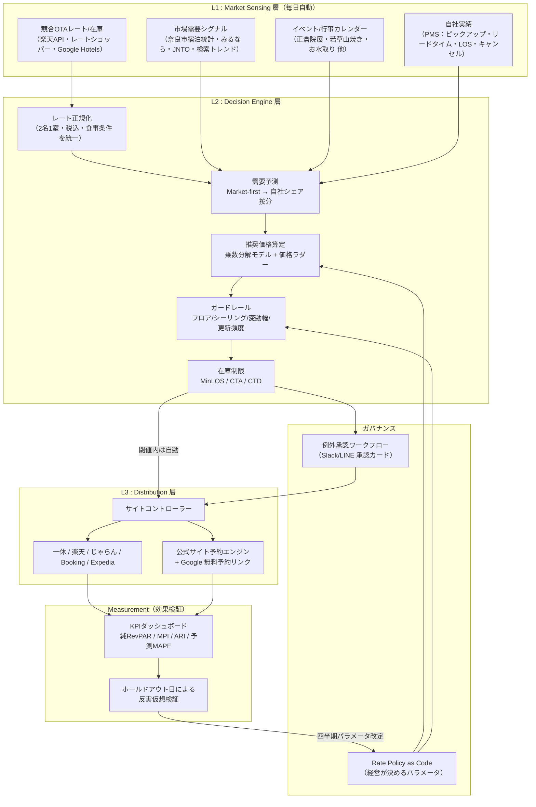

# 奈良春日 鹿のや｜レベニュー・オペレーティング・システム（RevOS）構築 企画書

**— 「優秀なレベニューマネジャーがいなくても回る」価格決定基盤の設計 —**

版：v1.0 / 2026年8月
対象施設：奈良春日 鹿のや（奈良市春日野町・全5室・レストラン/バー併設のスモールラグジュアリー）

---

## 0. エグゼクティブサマリー

### 0-1. 結論

**「人が価格を決める」体制から、「人が価格ルールを決め、機械が毎日価格を出す」体制へ移行する。**

そのために、以下の3層＋2ガバナンスからなる **Revenue Operating System（以下 RevOS）** を構築することを提案する。

| 層 | 名称 | 役割 | 属人性排除への寄与 |
|---|---|---|---|
| L1 | **Market Sensing 層** | 競合OTA価格・在庫、市場需要、イベント、自社ピックアップを毎日自動収集 | 「勘」の入力元だった情報収集を全自動化・全件記録化 |
| L2 | **Decision Engine 層** | 需要予測 → 推奨ADR/最低宿泊日数を算出、根拠を要因分解で出力 | 判断の再現性。誰が見ても同じ答えが出る |
| L3 | **Distribution 層** | サイトコントローラー経由でOTA・自社予約エンジンへ自動配信 | 反映漏れ・タイムラグ・入力ミスの排除 |
| G1 | **Rate Policy as Code** | 価格の下限・上限・割引権限・LOS方針を"コード化された文書"として管理 | 経営判断とオペレーションの分離 |
| G2 | **Operating Rhythm** | 週次15分スタンドアップ／月次RM委員会／四半期パラメータ改定 | 担当者交代でも壊れない運用リズム |

### 0-2. 投資判断上の要点（先に結論を述べる）

5室単体で「フルスクラッチのRMS」を作るのは投資対効果に合わない。**推奨は「Buy the plumbing, Build the brain（配管は買い、頭脳は自社で持つ）」**である。

- **買うもの**：競合レート収集（レートショッパー）、サイトコントローラー、PMS/予約エンジン
- **自社で持つもの**：①コンプセット定義とレート正規化ルール、②純ADR（手数料控除後）で最適化する意思決定ロジック、③価格ポリシー文書、④実績データ資産

理由は単純で、**レートの「収集」は市場価格が付いたコモディティだが、レートの「決め方」は施設固有の資産**であり、外部SaaSの汎用ロジックは5室のオーベルジュ（＝厨房キャパ制約・1室が在庫の20%）を最適化できないためである。

### 0-3. 期待効果（前提付き試算・詳細は `04_システム構成・ロードマップ・投資対効果.md`）

年間稼働可能室数 = 5室 × 365日 = 1,825室夜。稼働率70%・ADR 8万円を仮定した場合の年間客室売上は約1.02億円。

| シナリオ | ADR | 稼働率 | 客室RevPAR | 年間客室売上 | 現状比 |
|---|---|---|---|---|---|
| 現状（仮置き） | 80,000円 | 70.0% | 56,000円 | 約1.02億円 | — |
| RevOS導入後（保守） | +4% (83,200) | +1.5pt (71.5%) | 59,488円 | 約1.09億円 | **+6.2%** |
| RevOS導入後（標準） | +7% (85,600) | +3.0pt (73.0%) | 62,488円 | 約1.14億円 | **+11.6%** |

標準シナリオで **年間 +1,180万円**。システム年間コスト（後述・ハイブリッド案で年200〜400万円）に対し、初年度から回収可能な水準。加えて直販比率改善による手数料削減（後述）が上乗せされる。

> ⚠️ 上記ADR・稼働率は公開情報から確認できなかったため仮置きである。Phase 0 の実績データ棚卸しで実数に差し替えることを前提とする。

---

## 1. 前提認識：鹿のやの構造的特性と、それがRMに与える含意

公開情報から確認できる施設特性と、レベニューマネジメント（以下RM）上の含意を整理する。

| 施設特性 | 事実 | RM上の含意（＝設計要件） |
|---|---|---|
| **極小在庫** | 全5室 | 1室＝在庫の20%。稼働率は20%刻みでしか動かず、統計的な需要予測が自社データだけでは成立しない → **市場需要を先に予測し、自社シェアで按分する「Market-first Forecasting」が必須** |
| **立地の希少性** | 世界遺産・春日大社の森に隣接、若草山1分・東大寺10分。奈良公園内に宿泊できる施設は極めて限定的 | 代替不可能性が高い＝**価格弾力性が低い**。値下げによる稼働獲得より、**ピーク日の取りこぼし（＝安売り）の方が損失が大きい** |
| **オーベルジュ型** | レストラン・バー併設、朝食（和朝食）約6,600円 | 客室単体でなく **TRevPAR（総売上RevPAR）で最適化**すべき。かつ**厨房キャパという第二の在庫制約**が存在 |
| **販売チャネル** | 一休.com・楽天トラベル等のOTA、および公式サイト | チャネル別手数料が8%〜20%超と大きく異なる → **表示ADRではなく「純ADR」で意思決定する必要** |
| **強い季節・行事変動** | 正倉院展（10〜11月）、若草山焼き（1月第4土）、お水取り（3/1〜14）、なら燈花会（8月上旬）、中元万燈籠（8/14-15）、桜・紅葉 | **イベント需要の事前織り込みが収益の大半を決める**。人手では毎年再現できない → カレンダーのデータ化が必須 |
| **奈良市場の特性** | 奈良市内客室稼働率は月次で大きく変動（2026年6月 65.7%、前月比▲15.6pt）。県全体でインバウンドが減少局面 | 市場のボラティリティが高い＝**固定的な料金表では必ず取りこぼす**。同時に、市場下落局面での安易な値下げ連鎖に巻き込まれない**フロア防衛**が必要 |

### 1-1. 5室であることの決定的な意味

一般的なRMSは「100室・稼働率の連続的な変化・十分な予約サンプル数」を前提に設計されている。5室ではこの前提が崩れる。

- 稼働率の取りうる値は **0%, 20%, 40%, 60%, 80%, 100%** の6値のみ
- 1件のキャンセルが稼働率を20pt動かす
- 過去1年の自社予約件数は数百件規模 → 機械学習の学習データとして不足

したがって本提案では、**「自社データで需要を学習する」設計を採らない**。代わりに、

1. **市場（奈良市／コンプセット）の需要水準を外部データで推定する**
2. **その市場水準に対する自社の相対ポジション（価格順位・残室速度）で価格を決める**
3. **意思決定は機械学習ではなく、説明可能なルール＋パラメータで行う**

という設計とする。これは同時に「なぜこの価格なのか」を経営者が理解・監査できるという、属人性排除の本質的要件も満たす。

---

## 2. 課題の再定義：「人に依存するRM」の3つの失敗モード

「レベニューマネジャーの経験・力量に左右されない形にしたい」というご要望を、失敗モードとして具体化する。

### 失敗モード①：入力の失敗（見ていない／見きれない）

競合5〜10施設 × 今後180日 × 部屋タイプ × 食事条件 = 数千〜数万セルを人が毎日見ることは物理的に不可能。結果、**直近1〜2週間しか見ていない**、**特定のOTAしか見ていない**という近視眼が発生する。予約リードタイムの長いラグジュアリー需要（3〜6ヶ月前）を取りこぼす典型パターン。

→ **対策：L1 Market Sensing 層による全件自動収集**

### 失敗モード②：判断の失敗（基準が言語化されていない）

「たぶん高い」「そろそろ下げよう」という判断は、担当者が変われば再現されない。特に危険なのは以下の2つ：

- **恐怖の値下げ**：残室が埋まらない不安から、直前に値下げ → 価格を待つ顧客を学習させ、翌年以降のブッキングカーブが後ろ倒しになる（構造的なADR毀損）
- **機会損失の見過ごし**：3ヶ月前に完売した日 = ほぼ確実に **安すぎた**。しかし「満室＝成功」と誤認され、放置される

→ **対策：L2 Decision Engine による式とパラメータでの判断、および「早期完売日」の自動検知アラート**

### 失敗モード③：実行の失敗（決めたことが反映されない）

決めた価格がOTAごとに手作業更新され、反映漏れ・レート不整合（パリティ崩れ）・更新遅延が発生する。5室規模では担当者が接客・仕入と兼務するため、繁忙期ほど更新が止まるという最悪の相関を持つ。

→ **対策：L3 Distribution 層による自動配信＋差分監視**

---

## 3. 提案の骨子：RevOS のアーキテクチャ



各層の詳細仕様は以下の別冊に記載する。

- L1 の詳細（データソース・取得手段・法務整理）→ `02_データソース設計と法務整理.md`
- L2 の詳細（算定式・パラメータ・疑似コード）→ `03_価格決定エンジン仕様.md`
- L3 と実装計画（構成図・工数・費用・ROI）→ `04_システム構成・ロードマップ・投資対効果.md`
- 動作する試作実装 → `poc/`

---

## 4. 属人性排除の中核：Rate Policy as Code

RevOS の思想的な中心はここにある。**「価格を決める人」を「価格ルールを決める人」に変える。**

日々の価格決定はエンジンが行う。人間（経営・支配人）が決めるのは、以下の**パラメータ表だけ**である。これを1枚のYAML/スプレッドシートとしてバージョン管理し、変更履歴を残す。

### 4-1. ポリシーの構成要素（鹿のや向け初期値の例）

| 分類 | パラメータ | 初期値の考え方 | 誰が決めるか |
|---|---|---|---|
| **目標** | 年間目標 純RevPAR | 予算から逆算 | 経営 |
| | 目標直販比率 | 例：25% → 40% | 経営 |
| **フロア（下限）** | 絶対フロア（ブランド毀損防止） | 「この価格では売らない」ライン。ラグジュアリーでは変動費積上げより**ブランド基準が優先** | 経営 |
| | 変動費フロア | (客室変動費＋F&B原価＋清掃) ÷ (1 − チャネル手数料率) | 経営／経理 |
| **シーリング（上限）** | 絶対シーリング | 未検証価格帯への暴走防止。コンプセットP90 × 係数 等 | 経営 |
| **変動幅** | 1日あたり最大変動率 | 例：±15%（価格の乱高下による信頼失墜防止） | 支配人 |
| | 更新頻度 | 例：1日1回 06:00 JST | 支配人 |
| **需要係数** | イベント日リフト率 | 正倉院展・若草山焼き等、行事ごとに設定 | RM委員会 |
| | 曜日係数 | 金土 / 日〜木 | RM委員会 |
| **在庫制限** | MinLOS 発動条件 | 例：3連休中日は2泊以上 | RM委員会 |
| **チャネル** | チャネル別手数料率 | 実効手数料（販促プログラム込み） | 経理 |
| | 直販優遇の方法 | 価格差ではなく**特典差**（後述） | 経営／法務 |
| **例外** | 自動配信を許す変動幅 | 例：±10%以内は自動、超過は承認 | 経営 |

### 4-2. なぜ「価格差」ではなく「特典差」で直販を優遇するのか

OTA契約には価格同等性（レートパリティ）条項が含まれることが一般的である。一方で当該条項は各国・日本国内でも競争法上の論点となっており、契約類型により許容範囲が異なる。**契約書の実際の条項を法務確認したうえで**、以下の順で直販を優位化する設計を推奨する。

1. **非価格の便益差**（レイトチェックアウト、ウェルカムドリンク、館内利用クレジット、貸切利用の優先枠）→ パリティ条項の影響を受けにくい
2. **会員限定価格**（クローズドユーザーグループ）→ 多くの契約で公開レートの対象外
3. **在庫の差**（特別室の直販先行解放）
4. **公開価格そのものの差** → 契約確認が必須。安易に実施しない

> 純ADRの観点では、表示10万円の予約は 一休/楽天（手数料8〜12%程度）で純88,000〜92,000円、Booking/Expedia（実効15〜25%）で純75,000〜85,000円、直販（決済手数料3.5%程度）で純96,500円と大きく異なる。**同じ表示価格でも、直販1泊はOTA1泊の1.05〜1.28泊分の価値**を持つ。この換算をエンジンに組み込むことが、本提案の収益インパクトの重要部分を占める。

---

## 5. 運営リズムとRACI（担当者が代わっても壊れない仕組み）

システムを入れても、運用の型がなければ属人化は再発する。以下の3層の運営リズムを制度として定義する。

### 5-1. 日次（所要0分・完全自動）

- 06:00 JST：エンジンが今後365日の推奨価格を算出 → 変動±10%以内は自動配信
- 超過分のみ、Slack/LINEに**承認カード**が届く（下記フォーマット）

```
【要承認】2026-11-03（火・祝／正倉院展会期中）
 現在価格 : 98,000円  →  推奨 128,000円（+30.6%）
 根拠     : コンプセット中央値 +18%（5施設中4施設が満室）
            残室 2/5・同時期前年比ピックアップ +140%
            イベント係数 1.25（正倉院展）
 想定影響 : 純RevPAR +6,000円/日
 [承認] [据置] [金額を指定]
```

### 5-2. 週次（15分・月曜朝）

見る数字は **4つだけ**に固定する。ダッシュボードの1画面目をこの4指標に限定する。

1. 今後90日の **ピックアップ**（前週比の予約増分）と **On-the-books 対 予算**
2. **予測 vs 実績**（先週のフォーキャスト誤差）
3. **コンプセット指数 MPI / ARI**（自社は市場に対して稼働・単価どちらで勝っているか）
4. **純ADR とチャネルミックス**

### 5-3. 月次（60分・RM委員会）

- パラメータ改定の議論（イベント係数、曜日係数、フロア・シーリング）
- **早期完売日レビュー**（＝安すぎた日の特定と、翌年同時期の初期価格引き上げ）
- **未達日レビュー**（＝制限が強すぎた日、MinLOSの副作用検証）

### 5-4. RACI

| 意思決定 | 経営 | 支配人 | エンジン | 外部パートナー |
|---|---|---|---|---|
| 目標・フロア・シーリング設定 | **A/R** | C | I | C |
| 日々の価格決定 | I | I | **R** | — |
| 例外承認（±10%超の変動） | C | **A/R** | I | — |
| イベント係数の改定 | A | **R** | I | C |
| コンプセット定義の見直し | A | R | I | **C** |
| データ収集の稼働監視 | I | I | R | **A/R** |

（A=承認、R=実行、C=協議、I=報告）

**この表があること自体が、属人性排除の実体である。** 担当者が交代した際の引き継ぎは、この表と Rate Policy の1枚があれば完了する。

---

## 6. KPI体系

「売上が上がった」では検証にならない。以下の階層でKPIを定義する。

### 6-1. 収益KPI（結果指標）

| KPI | 定義 | なぜ見るか |
|---|---|---|
| **純RevPAR** | (客室売上 − チャネル手数料) ÷ 総客室数 | **最重要**。表示ADRの見栄えに騙されない |
| RevPAR | 客室売上 ÷ 総客室数 | 業界比較用 |
| ADR / OCC | — | 分解して要因把握 |
| **TRevPAR** | (客室＋F&B＋その他) ÷ 総客室数 | オーベルジュとしての実力 |
| GOPPAR | 営業総利益 ÷ 総客室数 | 経営判断の最終指標 |
| 直販比率 | 直販泊数 ÷ 総泊数 | 手数料構造の改善度 |

### 6-2. 市場ポジションKPI（相対指標）

| KPI | 定義 | 目標の考え方 |
|---|---|---|
| **MPI**（稼働指数） | 自社OCC ÷ コンプセットOCC × 100 | 100超＝市場より高稼働 |
| **ARI**（単価指数） | 自社ADR ÷ コンプセットADR × 100 | 鹿のやは希少性から**ARI > 110 を狙う** |
| **RGI**（収益指数） | 自社RevPAR ÷ コンプセットRevPAR × 100 | 総合力。**RGI 115以上**が目標 |
| 価格順位 | コンプセット内での価格ランク | 意図した位置にいるか |

### 6-3. プロセスKPI（システムが機能しているかの指標）

| KPI | 目標水準 | 意味 |
|---|---|---|
| データ収集成功率 | 99%以上 | 収集が止まればRevOSは死ぬ |
| データ鮮度 | 24時間以内 | 陳腐化した競合価格での判断を防ぐ |
| 需要予測 MAPE（30日前） | 20%以内 | 予測精度の管理 |
| 推奨価格の自動採用率 | 85%以上 | 低いならパラメータが実態に合っていない |
| 早期完売日の発生率 | 5%以下 | 高いなら値付けが安すぎる |
| レートパリティ違反検知数 | 0件 | 契約リスクの管理 |

---

## 7. 内製 / SaaS / ハイブリッドの比較と推奨

| 論点 | ①フルSaaS（既存RMS） | ②フルスクラッチ内製 | **③ハイブリッド（推奨）** |
|---|---|---|---|
| 初期費用 | 0〜50万円 | 500〜1,500万円 | 150〜400万円 |
| 年間費用 | 40〜120万円 | 100〜200万円（保守・基盤） | 120〜300万円 |
| 導入期間 | 1〜2ヶ月 | 9〜15ヶ月 | 3〜6ヶ月 |
| 5室・オーベルジュへの適合 | △ 汎用ロジックで厨房制約や1室=20%の離散性を扱えない | ◎ | ◎ |
| 純ADR最適化 | △ 実装状況はベンダー依存 | ◎ | ◎ |
| データ資産の帰属 | ✕ ベンダー側 | ◎ 自社 | ◎ 自社 |
| 属人性排除 | ○ ただし「ベンダー依存」という別の属人性 | ◎ | ◎ |
| 多施設への横展開 | △ 施設ごとに課金 | ◎ | ◎ |
| 主なリスク | 解約時にロジックとデータを失う | 開発失敗・保守要員の不在 | 統合の複雑性 |

### 推奨：③ハイブリッド「Buy the plumbing, Build the brain」

- **買う（Plumbing）**：競合レート収集API／レートショッパー、サイトコントローラー、PMS・予約エンジン、BI基盤
- **作る（Brain）**：コンプセット定義とレート正規化ルール、需要予測、純ADRベースの価格算定、ポリシー管理、承認ワークフロー、KPIダッシュボード

**根拠：**

1. レート収集は既に市場価格が付いたコモディティ。自前スクレイピングは法務リスクと保守コスト（OTAのHTML改変への追随）を恒常的に抱えるだけで差別化にならない
2. 一方、価格の決め方は施設固有。特に鹿のやは「5室」「オーベルジュ」「奈良公園内という代替不可能な立地」という、汎用RMSが想定していない条件が3つ揃っている
3. 100 DOORS & RESORTS 系列としてのポートフォリオ横展開を前提とするなら、意思決定ロジックとデータ基盤は自社資産として持つ方が長期的に有利
4. 単館運営でSaaSのみを選ぶ場合でも、**本企画書の第4章（Rate Policy）と第5章（運営リズム）は必ず実施すべき**。属人性排除の主因はシステムではなく運用の型にあるため

---

## 8. 主要リスクと対応

| # | リスク | 影響 | 対応策 |
|---|---|---|---|
| R1 | **競合レート収集の停止**（OTA仕様変更・アクセス制限） | 判断根拠の喪失 | 複数ソースの冗長化（公式API＋ライセンス済み第三者API）。収集失敗時は「前回値＋鮮度警告」でフォールバックし、自動配信を停止して手動モードへ縮退 |
| R2 | **法務リスク**（利用規約違反・過度なアクセス） | 契約解除・法的紛争 | 調達方針を3段階に固定（公式API＞ライセンス済み第三者API＞自前収集）。自前収集は法務承認制・レート制限必須（詳細は別冊02） |
| R3 | **自動配信の暴走**（バグによる異常価格の配信） | 重大な収益毀損・ブランド毀損 | 二重ガードレール（エンジン側＋サイトコントローラー側の上下限）、変動幅上限、配信前サニティチェック、Kill Switch（1クリックで全自動配信停止） |
| R4 | **予測が外れる**（極小在庫ゆえの分散） | 過剰な価格変動 | 予測は「点」でなく「区間」で扱い、不確実性が高い日は価格変動を抑制する設計（別冊03参照） |
| R5 | **コンプセットの誤定義** | 誤った市場認識 | 四半期ごとに見直し。「価格の似た施設」ではなく**「顧客が実際に比較検討した施設」**で定義（予約時アンケート・直販サイトの離脱先分析で補正） |
| R6 | **F&B（厨房）キャパの無視** | 客室は売れたが夕食提供不可 | 厨房の最大提供数を第二の在庫としてエンジンに入力。上限到達時は「夕食なしプラン」へ自動切替 |
| R7 | **運用の形骸化**（ダッシュボードが見られなくなる） | 数ヶ月で元の勘に戻る | 週次15分・指標4つに絞る。承認カードをLINE/Slackに送り、「見に行く」を「届く」に変える |
| R8 | **価格の乱高下による顧客の不信** | ブランド毀損・リピート減 | 1日あたり変動幅の上限設定、公開済み予約への遡及なし、直前値下げの原則禁止（別冊03の「値下げ禁止則」） |

---

## 9. 次のアクション（Phase 0：最初の30日）

| # | アクション | 成果物 | 担当 |
|---|---|---|---|
| 1 | 実績データの棚卸し（過去2〜3年の予約明細・ADR・稼働・チャネル別・リードタイム） | 現状診断レポート | 施設＋コンサル |
| 2 | **コンプセットの確定**（一次3〜5施設／二次5〜8施設） | コンプセット定義書 | RM委員会 |
| 3 | チャネル別**実効手数料**の実測（販促プログラム込み） | 純ADR換算表 | 経理 |
| 4 | Rate Policy 初版の策定（フロア・シーリング・変動幅） | policy.yaml v0.1 | 経営 |
| 5 | OTA契約のパリティ条項レビュー | 法務メモ | 法務 |
| 6 | 既存システム（PMS・サイトコントローラー）のAPI仕様確認 | 連携可否一覧 | 情シス／ベンダー |
| 7 | データ調達方式の決定（自社API取得 vs レートショッパー購入） | 調達決定書 | 経営 |

---

## 付属資料

| 資料 | 内容 |
|---|---|
| `02_データソース設計と法務整理.md` | 何を・どこから・どう取るか。Googleマップ／Google Hotels 活用の実務と限界、法的整理 |
| `03_価格決定エンジン仕様.md` | 需要予測モデル、価格算定式、ガードレール、LOS制御、検証方法、疑似コード |
| `04_システム構成・ロードマップ・投資対効果.md` | 技術構成、データモデル、12ヶ月ロードマップ、費用、ROI感度分析 |
| `poc/` | 価格決定エンジンの動作する試作実装（Python） |
