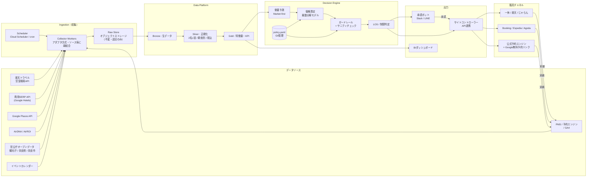
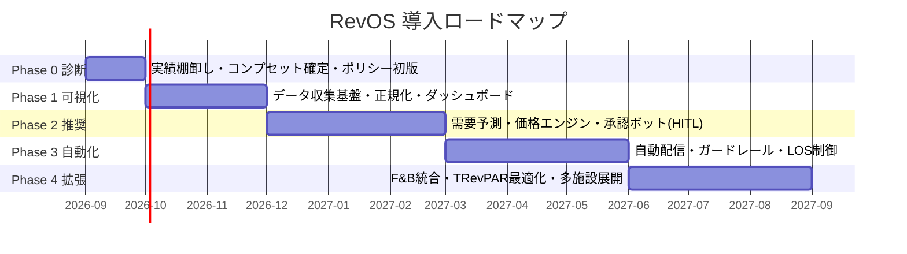

# 別冊04｜システム構成・ロードマップ・投資対効果

---

## 1. システム構成

### 1-1. 全体アーキテクチャ



### 1-2. コンポーネント仕様

| # | コンポーネント | 責務 | 技術選択肢 | 備考 |
|---|---|---|---|---|
| 1 | **Scheduler** | 日次バッチの起動 | Cloud Scheduler / GitHub Actions / cron | 収集は深夜帯（02:00-05:00 JST） |
| 2 | **Collector** | ソース別データ取得。**アダプタパターンで1ソース1クラス** | Python + httpx / Cloud Run Jobs | ソース追加・廃止に強い構造。1つが落ちても他は動く |
| 3 | **Raw Store** | 取得データの不変保存 | GCS / S3（日付パーティション） | **加工しない**。正規化ルール変更時に遡って再計算するため |
| 4 | **Normalizer** | 同一条件への正規化 | dbt / SQL + Python | **最重要かつ最も工数を要する**（別冊02 第5章） |
| 5 | **Feature Store** | 特徴量の生成・保存 | BigQuery / DuckDB | 小規模なら DuckDB + Parquet で十分 |
| 6 | **Decision Engine** | 需要予測・価格算定 | Python（純粋関数として実装） | **副作用を持たせない**設計。テスト容易性が信頼性を担保 |
| 7 | **Policy Store** | パラメータ管理 | Git（YAML）+ PR承認 | **変更履歴＝意思決定の記録**。監査可能性の中核 |
| 8 | **Approval Bot** | 承認カードの配信・受領 | Slack Bot / LINE Messaging API | 現場が最も使うUI。ここの体験がシステムの定着を決める |
| 9 | **Distributor** | サイトコントローラーへの配信 | 各社API | 二重ガードレール（配信側でも上下限チェック） |
| 10 | **BI Dashboard** | KPI可視化 | Looker Studio / Metabase | **1画面目は4指標のみ**（別冊01 第5-2章） |
| 11 | **Monitoring** | 収集成功率・鮮度・異常検知 | Cloud Monitoring + アラート | 「静かに壊れる」ことを防ぐ |

### 1-3. 中核データモデル

```sql
-- 競合レート観測（Bronze/Silver の中核テーブル）
CREATE TABLE rate_observation (
  observation_id     STRING,          -- UUID
  collected_at       TIMESTAMP,       -- 取得日時（重要：時系列で価格変化を追う）
  source             STRING,          -- rakuten_api / serp_google_hotels / airdna 等
  property_id        STRING,          -- 内部の統一施設ID
  property_name_raw  STRING,
  stay_date          DATE,            -- 対象宿泊日
  los                INT,             -- 検索時の滞在日数
  occupancy_persons  INT,             -- 検索時の人数
  room_type_raw      STRING,
  room_type_norm     STRING,          -- 正規化後グレード
  meal_plan_raw      STRING,
  meal_plan_norm     STRING,          -- room_only / breakfast / half_board
  cancel_policy      STRING,          -- flexible / non_refundable
  price_raw          NUMERIC,
  currency           STRING,
  tax_included       BOOL,
  price_normalized   NUMERIC,         -- ★2名1室・朝食別・税込・LOS=1・返金可 に統一
  availability       STRING,          -- available / sold_out / restricted / not_offered
  channel            STRING,          -- ikyu / rakuten / booking / expedia / direct
  normalization_note STRING,          -- 正規化で適用した補正の記録（監査用）
  PRIMARY KEY (observation_id)
);

-- 自社の予約残高（日次スナップショット）
CREATE TABLE otb_snapshot (
  snapshot_date DATE, stay_date DATE,
  rooms_sold INT, rooms_available INT,
  adr NUMERIC, net_adr NUMERIC,
  by_channel JSON, avg_los NUMERIC, cancellations INT,
  PRIMARY KEY (snapshot_date, stay_date)
);

-- 価格推奨の全履歴（監査・検証の基盤）
CREATE TABLE rate_recommendation (
  recommended_at TIMESTAMP, stay_date DATE,
  current_price NUMERIC, recommended_price NUMERIC,
  factors JSON,          -- 要因分解（base/pace/comp/event/inventory/lead/shrinkage）
  evidence JSON,         -- 判断根拠（コンプセット詳細・OTB・DPI）
  min_los INT, restrictions JSON,
  auto_published BOOL,
  human_action STRING,   -- approved / held / overridden / null
  override_price NUMERIC, override_reason STRING,   -- ★人の介入を学習データ化
  policy_version STRING, -- どのpolicy.yamlで算出したか
  PRIMARY KEY (recommended_at, stay_date)
);

-- イベントマスタ
CREATE TABLE event_master (
  event_id STRING, name STRING,
  start_date DATE, end_date DATE,
  category STRING,         -- 寺社行事 / 展覧会 / 自然 / 祝日
  distance_km NUMERIC, relevance NUMERIC,
  lift_current NUMERIC,    -- 現行係数
  lift_evidence JSON,      -- 過去実績からの推定根拠
  confidence NUMERIC,
  PRIMARY KEY (event_id)
);
```

> `rate_recommendation` に **`human_action` と `override_reason` を必ず残す**ことが設計上の要点である。人がエンジンを上書きした事実と理由が蓄積されれば、それは「経験の外部化」そのものになり、四半期のパラメータ改定に直接使える。

---

## 2. 導入ロードマップ（12ヶ月）



### Phase 0：診断とポリシー策定（1ヶ月）

| 成果物 | 内容 | 判定基準 |
|---|---|---|
| 現状診断レポート | 過去2〜3年のADR/稼働/チャネル別/リードタイム/キャンセル分析 | 早期完売日と機会損失日が特定できている |
| コンプセット定義書 | 一次3〜5施設、二次5〜8施設 | 「価格が近い施設」ではなく「顧客が実際に比較した施設」で定義 |
| 純ADR換算表 | チャネル別実効手数料の実測 | 販促プログラム込みの実数 |
| `policy.yaml` v0.1 | フロア・シーリング・目標ARI | 経営承認済み |
| 法務メモ | パリティ条項・データ収集の可否 | 顧問弁護士レビュー済み |

> **Phase 0 だけでも実施価値がある。** 過去実績の棚卸しと早期完売日の特定は、システムなしでも即座に翌年の値付け改善につながる。

### Phase 1：可視化（2ヶ月）— *意思決定は人、根拠は自動*

- Collector 実装（楽天API＋SERP API＋オープンデータ）
- 正規化パイプライン
- KPIダッシュボード（4指標＋コンプセットカレンダー）
- **この時点ではまだ価格を自動化しない。** まず「見える」ことに集中する

**達成基準**：毎朝、今後180日分のコンプセット価格・完売状況・自社ペースが1画面で見える

### Phase 2：推奨（3ヶ月）— *Human-in-the-Loop*

- 需要予測・価格エンジン実装
- 承認ボット（Slack/LINE）
- **全ての推奨に人の承認を必須とする**（自動配信なし）
- 3ヶ月間の推奨採用率と精度を測定

**達成基準**：推奨価格の採用率85%以上、予測MAPE 20%以内

### Phase 3：自動化（3ヶ月）

- 変動±10%以内の自動配信を開始
- サイトコントローラー連携
- LOS制御（MinLOS/CTA/CTD）の自動発動
- ホールドアウト日による効果検証を開始

**達成基準**：純RevPARが対照群比で有意にプラス、パリティ違反0件

### Phase 4：拡張（3ヶ月）

- F&B（厨房キャパ）を第二在庫としてエンジンに統合、TRevPAR最適化
- Denied/Regret 分析の実装
- **100 DOORS & RESORTS 系列の他施設へ横展開**（マルチテナント化）

---

## 3. 体制と工数

| 役割 | 関与 | 工数目安 | 内製/外部 |
|---|---|---|---|
| プロジェクトオーナー（経営） | 意思決定、ポリシー承認 | 月4時間 | 内製 |
| RMリード（支配人等） | コンプセット定義、例外承認、週次レビュー | 週2時間 | 内製 |
| データエンジニア | 収集基盤・正規化・配信連携 | Phase1-3で 0.5〜0.8人月/月 | 外部（推奨） |
| アナリスト／RMコンサル | 需要予測設計、パラメータ設計、検証 | Phase0-2で 0.3〜0.5人月/月 | 外部 |
| 法務 | 規約・パリティレビュー | スポット | 外部顧問 |

> **要点**：内製で必要なのは「経営の意思決定」と「週2時間のRMリード」だけである。**専任のレベニューマネジャーを雇用する必要はない** — これがご要望に対する直接的な回答である。

---

## 4. 費用試算

### 4-1. 初期費用（ハイブリッド案）

| 項目 | 金額 | 備考 |
|---|---|---|
| Phase 0 診断・ポリシー策定 | 60〜120万円 | 外部コンサル |
| Phase 1 収集基盤・正規化・BI | 80〜150万円 | 開発委託 |
| Phase 2 エンジン・承認ボット | 100〜180万円 | 開発委託 |
| Phase 3 配信連携・LOS制御 | 60〜120万円 | 開発委託 |
| 法務レビュー | 20〜40万円 | スポット |
| **合計** | **320〜610万円** | 段階実施のため中断可能 |

### 4-2. ランニング費用（年間）

| 項目 | 年額 | 備考 |
|---|---|---|
| クラウド基盤 | 15〜40万円 | 小規模のためサーバレス構成で十分 |
| 商用SERP API（Google Hotels） | 8〜40万円 | クエリ数依存 |
| Google Places API | 0〜10万円 | 無料枠内に収まる可能性が高い |
| 楽天ウェブサービス | 0円 | 公式・無償 |
| AirDNA 等（任意） | 0〜36万円 | 一棟貸し競合を見る場合 |
| レートショッパーSaaS（任意・代替案） | 36〜120万円 | 内製収集の代わりに購入する場合 |
| 保守・改善（外部） | 60〜120万円 | 月5〜10万円相当 |
| **合計** | **約120〜300万円** | |

### 4-3. 代替案との比較

| 案 | 初期 | 年間 | 導入期間 | 適合性 |
|---|---|---|---|---|
| A. 既存RMS（SaaS）のみ | 0〜50万円 | 40〜120万円 | 1〜2ヶ月 | △ 5室・オーベルジュ特性に非対応、データは他社所有 |
| B. フルスクラッチ内製 | 500〜1,500万円 | 100〜200万円 | 9〜15ヶ月 | △ 単館ではROIが合わない |
| **C. ハイブリッド（推奨）** | **320〜610万円** | **120〜300万円** | **3〜6ヶ月** | **◎** |
| D. Phase 0+1 のみ実施 | 140〜270万円 | 40〜90万円 | 3ヶ月 | ○ **最小構成での試行として有効** |

> **予算制約が強い場合の推奨**：まず **D案（Phase 0＋1）** を実施する。「見える化」だけでも早期完売日の是正とイベント日の値付け改善が効き、それだけで投資回収できる可能性が高い。効果を確認してから Phase 2 以降に進む判断ができる。

---

## 5. 投資対効果（ROI）

### 5-1. 前提

| 項目 | 値 | 出所 |
|---|---|---|
| 客室数 | 5室 | 公開情報 |
| 年間販売可能室数 | 1,825室夜 | 5×365 |
| 現状ADR | 80,000円（**仮置き**） | Phase 0 で実数確定 |
| 現状稼働率 | 70%（**仮置き**） | 奈良市の市場稼働率を参考に設定 |
| 現状OTA比率 | 75%（**仮置き**） | — |
| 平均実効手数料 | 11%（**仮置き**） | — |

### 5-2. 効果の内訳（標準シナリオ）

| 効果源 | 内容 | 年間効果 |
|---|---|---|
| ① **ピーク日の値付け適正化** | 正倉院展・若草山焼き・紅葉・桜等 約60日で平均+15% | **+約540万円** |
| ② **早期完売日の是正** | 年間10〜20日の「安売り」を翌年+10%へ | +約120万円 |
| ③ **閑散日の稼働改善** | 制限緩和・チャネル開放で +3pt | +約340万円 |
| ④ **直前値下げの抑止** | ブッキングカーブ維持によるADR保全 | +約100万円 |
| ⑤ **直販シフト（25%→40%）** | 手数料差10pt × 15pt × 年間売上 | **+約120万円**（利益ベース） |
| ⑥ **MinLOS による前後日の同時充足** | ピーク前後の空室固定化を解消 | +約80万円 |
| **合計（売上ベース）** | | **+約1,180万円** |
| **合計（純収益ベース）** | 手数料控除後 | **+約1,050万円** |

### 5-3. 投資回収

| | 初年度 | 2年目 | 3年目 |
|---|---|---|---|
| 効果（純収益） | +1,050万円 ×0.6（段階導入のため） = **+630万円** | +1,050万円 | +1,050万円 |
| 費用 | 初期465万円（中央値）+ 年間210万円 = **675万円** | 210万円 | 210万円 |
| 収支 | **▲45万円** | **+840万円** | **+840万円** |
| 累計 | ▲45万円 | +795万円 | +1,635万円 |

**投資回収期間：約13〜14ヶ月**

### 5-4. 感度分析（標準シナリオの効果に対する倍率）

| 前提の変動 | 効果への影響 |
|---|---|
| 現状ADRが 60,000円だった場合 | 効果 ×0.75（約790万円） |
| 現状ADRが 120,000円だった場合 | 効果 ×1.5（約1,580万円） |
| 現状稼働率が既に85%の場合 | ③が消え、①②④が拡大 → 効果 ×0.9 |
| 市場が10%縮小した場合 | 効果 ×0.7。ただし**下落局面ではフロア防衛の価値が上がる**（守りの効果） |
| D案（Phase0+1のみ）の場合 | 効果 ×0.4（約420万円）／費用も大幅減 → **ROIは実は最も高い** |

### 5-5. 多施設展開時の経済性（100 DOORS & RESORTS ポートフォリオ）

本システムの最大の投資価値は横展開にある。

| 施設数 | 初期費用 | 年間費用 | 1施設あたり年間費用 |
|---|---|---|---|
| 1施設 | 465万円 | 210万円 | 210万円 |
| 3施設 | 465＋120万円 | 300万円 | **100万円** |
| 5施設 | 465＋200万円 | 380万円 | **76万円** |
| 10施設 | 465＋350万円 | 550万円 | **55万円** |

**5施設以上で、施設あたりコストは単館SaaSを下回る。** かつ、コンプセットデータ・需要モデル・ポリシーのノウハウが全施設で共有・蓄積される。**この時点で、RevOS は運営会社の競争優位そのものになる。**

---

## 6. 意思決定に必要な次のアクション

| # | 決めること | 期限目安 | 決裁者 |
|---|---|---|---|
| 1 | Phase 0 の実施可否と予算 | 2週間以内 | 経営 |
| 2 | 内製/SaaS/ハイブリッドの方針（本書はハイブリッド推奨） | Phase 0 完了時 | 経営 |
| 3 | 目標ARI（本書は115を提案）と目標直販比率 | Phase 0 | 経営 |
| 4 | ブランドフロアの金額 | Phase 0 | 経営 |
| 5 | 多施設展開を前提とするか（費用配分が変わる） | Phase 0 | 経営 |
| 6 | 開発パートナーの選定 | Phase 1 着手前 | 経営 |

---

## 7. 本提案の要約（1行）

> **「レベニューマネジャーを雇う」のではなく、「レベニューマネジャーの判断を `policy.yaml` と1本のパイプラインに移植する」。**
> 経験は個人に属して消えるが、コード化されたポリシーは組織に残り、毎年賢くなる。
